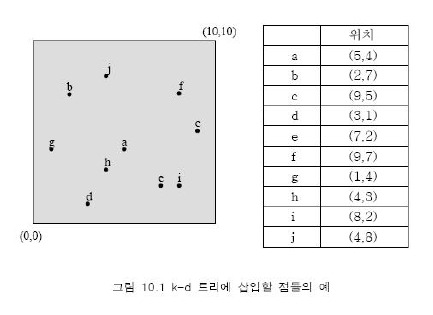
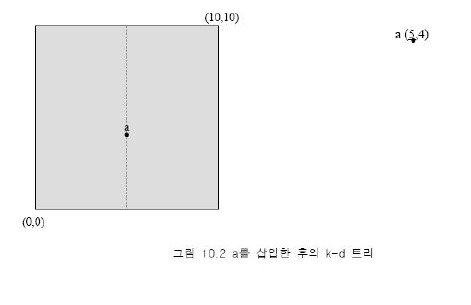
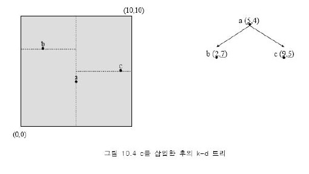

# kd 트리란
- k-d 트리는 다차원의 점 데이타를 인덱스할 수 있는 가장 간단하면서도 기본적인 데이터 구조이다.
- k-d 트리는 일반적으로 디스크 저장을 고려하지 않고 주기억장치 상에서 동작하는 인덱스 구조이다.
- 따라서 대용량의 데이타에 대해서는 적당하지 않고 소규모의 다차원 점 데이타를 인덱스할때 적당하다.


## 삽입
k-d 트리는 기본적으로 이원 탐색 트리를 다차원 공간으로 확장한 것이다.
따라서 기본적인 구조나 알고리즘은 이원 탐색 트리와 유사하다.
삽입하려는 값이 트리의 기존 노드의 값보다 작거나 같으면 왼쪽 자식노드에 저장하고, 
보다 크면 오른쪽 자식노드에 저장하게 된다.



이런 점들을 삽입한다 치면





이런 식으로 삽입이 진행된다.


```kotlin
// 점(Point) 클래스
data class Point(val x: Double, val y: Double)

// k-d 트리 노드(Node) 클래스
data class Node(val point: Point, val axis: Int, var left: Node? = null, var right: Node? = null)

// k-d 트리(KdTree) 클래스
class KdTree {
    private var root: Node? = null

    // 점을 삽입하는 메서드
    fun insert(point: Point) {
        root = insertRec(root, point, 0)
    }

    private fun insertRec(node: Node?, point: Point, depth: Int): Node {
        if (node == null) {
            return Node(point, depth % 2)
        }

        if (node.axis == 0) {
            if (point.x < node.point.x) {
                node.left = insertRec(node.left, point, depth + 1)
            } else {
                node.right = insertRec(node.right, point, depth + 1)
            }
        } else {
            if (point.y < node.point.y) {
                node.left = insertRec(node.left, point, depth + 1)
            } else {
                node.right = insertRec(node.right, point, depth + 1)
            }
        }

        return node
    }

    // 특정 범위 내의 점들을 검색하는 메서드
    fun rangeSearch(range: Rectangle): List<Point> {
        val found = mutableListOf<Point>()
        rangeSearchRec(root, range, found)
        return found
    }

    private fun rangeSearchRec(node: Node?, range: Rectangle, found: MutableList<Point>) {
        if (node == null) {
            return
        }

        if (range.contains(node.point)) {
            found.add(node.point)
        }

        if (node.axis == 0) {
            if (range.x - range.width < node.point.x) {
                rangeSearchRec(node.left, range, found)
            }
            if (range.x + range.width >= node.point.x) {
                rangeSearchRec(node.right, range, found)
            }
        } else {
            if (range.y - range.height < node.point.y) {
                rangeSearchRec(node.left, range, found)
            }
            if (range.y + range.height >= node.point.y) {
                rangeSearchRec(node.right, range, found)
            }
        }
    }
}

// 사각형(Rectangle) 클래스
data class Rectangle(val x: Double, val y: Double, val width: Double, val height: Double) {
    // 주어진 점이 이 사각형 안에 있는지 확인하는 메서드
    fun contains(point: Point): Boolean {
        return (point.x >= x - width &&
                point.x <= x + width &&
                point.y >= y - height &&
                point.y <= y + height)
    }
}

// 사용 예제
fun main() {
    // k-d 트리 생성
    val kdTree = KdTree()

    // 점들을 k-d 트리에 삽입
    kdTree.insert(Point(3.0, 6.0))
    kdTree.insert(Point(17.0, 15.0))
    kdTree.insert(Point(13.0, 15.0))
    kdTree.insert(Point(6.0, 12.0))
    kdTree.insert(Point(9.0, 1.0))
    kdTree.insert(Point(2.0, 7.0))
    kdTree.insert(Point(10.0, 19.0))

    // 특정 범위 내의 점들을 검색
    val range = Rectangle(10.0, 10.0, 10.0, 10.0)
    val found = kdTree.rangeSearch(range)

    // 검색된 점들을 출력
    for (point in found) {
        println("Found point: (${point.x}, ${point.y})")
    }
}

```