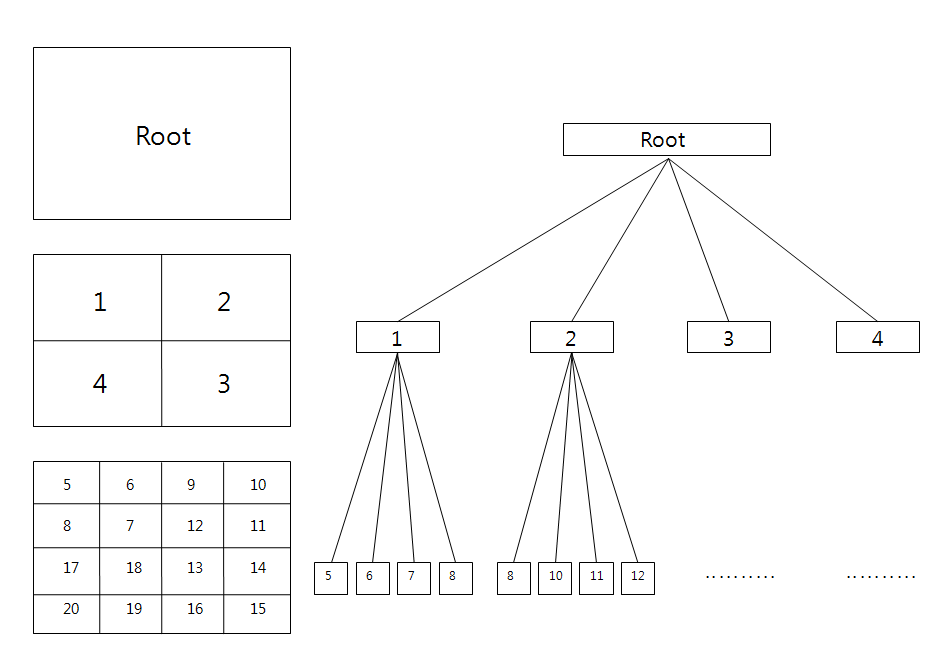

# 쿼드 트리

- 쿼드 트리는 4개의 자식 노드를 가지는 트리 구조의 자료구조다 
- 쿼드 트리는 2차원의 공간을 4개의 구역(4개의 자식노드)로 재귀적으로 분할한다 
- 쿼드 트리는 거대한 2차원 공간을 빠르게 검색 가능하다

## 구현 순서
- 쿼드트리로 저장하기 위한 지형을 4등분 한다
- 분할된 4개의 지역을 자신 노드로 추가한다
- 각 분할된 지역의 범위를 좌표로 기록
- 위 과정을 정해진 Depth 만큼 반복한다



```kotlin
// 점(Point) 클래스
data class Point(val x: Double, val y: Double)

// 사각형(Rectangle) 클래스
data class Rectangle(val x: Double, val y: Double, val width: Double, val height: Double) {
    // 주어진 점이 이 사각형 안에 있는지 확인하는 메서드
    fun contains(point: Point): Boolean {
        return (point.x >= x - width &&
                point.x < x + width &&
                point.y >= y - height &&
                point.y < y + height)
    }

    // 주어진 사각형이 이 사각형과 겹치는지 확인하는 메서드
    fun intersects(range: Rectangle): Boolean {
        return !(range.x - range.width > x + width ||
                 range.x + range.width < x - width ||
                 range.y - range.height > y + height ||
                 range.y + range.height < y - height)
    }
}

// 쿼드트리(Quadtree) 클래스
class Quadtree(val boundary: Rectangle, val capacity: Int) {
    private val points = mutableListOf<Point>()
    private var divided = false
    private var northeast: Quadtree? = null
    private var northwest: Quadtree? = null
    private var southeast: Quadtree? = null
    private var southwest: Quadtree? = null

    // 점을 삽입하는 메서드
    fun insert(point: Point): Boolean {
        // 점이 이 사각형에 포함되지 않으면 false 반환
        if (!boundary.contains(point)) {
            return false
        }

        // 용량이 다 차지 않았다면 점을 리스트에 추가
        if (points.size < capacity) {
            points.add(point)
            return true
        } else {
            // 용량이 다 찼으면 사각형을 분할
            if (!divided) {
                subdivide()
            }

            // 각 자식 사각형에 점을 삽입
            if (northeast!!.insert(point)) return true
            if (northwest!!.insert(point)) return true
            if (southeast!!.insert(point)) return true
            if (southwest!!.insert(point)) return true
        }

        return false
    }

    // 사각형을 4개로 분할하는 메서드
    private fun subdivide() {
        val x = boundary.x
        val y = boundary.y
        val w = boundary.width / 2
        val h = boundary.height / 2

        northeast = Quadtree(Rectangle(x + w, y - h, w, h), capacity)
        northwest = Quadtree(Rectangle(x - w, y - h, w, h), capacity)
        southeast = Quadtree(Rectangle(x + w, y + h, w, h), capacity)
        southwest = Quadtree(Rectangle(x - w, y + h, w, h), capacity)
        
        divided = true
    }

    // 특정 영역 내의 점들을 검색하는 메서드
    fun query(range: Rectangle, found: MutableList<Point>): List<Point> {
        if (!boundary.intersects(range)) {
            return found
        } else {
            for (point in points) {
                if (range.contains(point)) {
                    found.add(point)
                }
            }

            if (divided) {
                northeast?.query(range, found)
                northwest?.query(range, found)
                southeast?.query(range, found)
                southwest?.query(range, found)
            }
        }

        return found
    }
}

// 사용 예제
fun main() {
    // 쿼드트리의 경계와 용량 설정
    val boundary = Rectangle(200.0, 200.0, 200.0, 200.0)
    val qt = Quadtree(boundary, 4)

    // 점들을 쿼드트리에 삽입
    qt.insert(Point(100.0, 100.0))
    qt.insert(Point(150.0, 150.0))
    qt.insert(Point(300.0, 300.0))
    qt.insert(Point(400.0, 400.0))

    // 특정 영역 내의 점들을 검색
    val range = Rectangle(200.0, 200.0, 50.0, 50.0)
    val found = qt.query(range, mutableListOf())

    // 검색된 점들을 출력
    for (point in found) {
        println("Found point: (${point.x}, ${point.y})")
    }
}

```